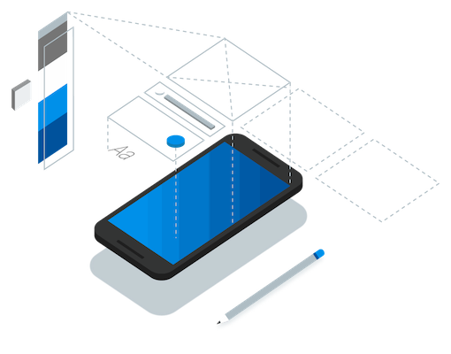
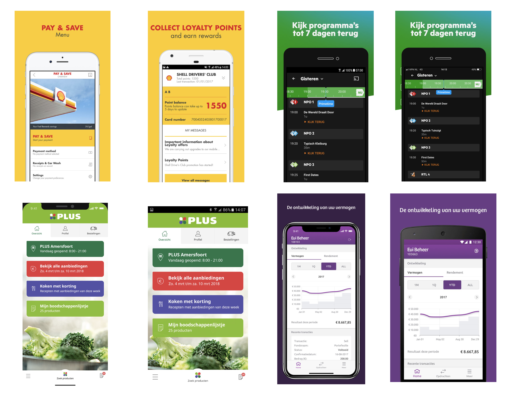
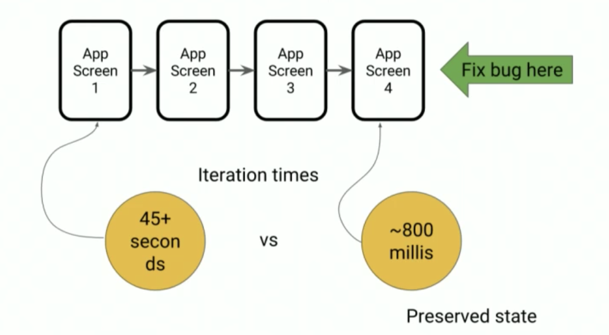
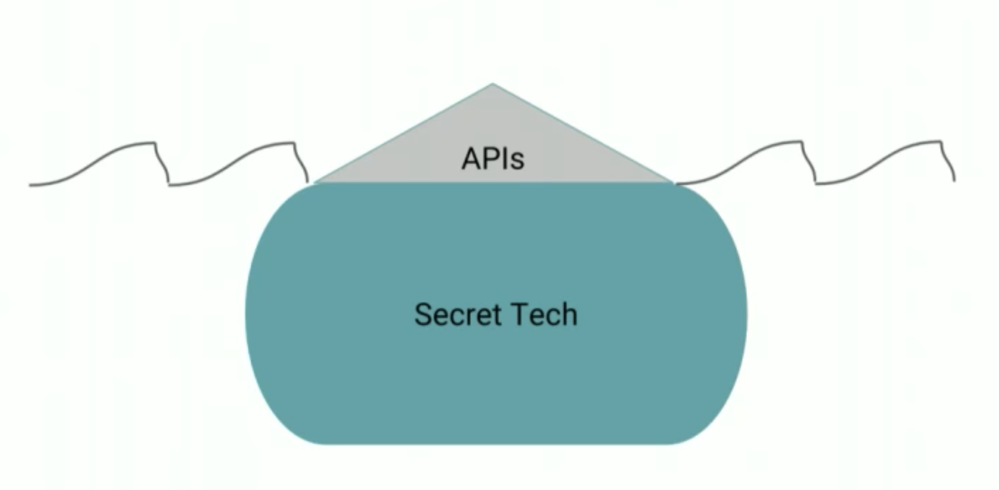

<!-- $theme: default -->


### Flutter in 30 minutes (or less)
###### for iOS developers



###### by Juan  


---

## Flutter?? WTF???

Flutter is an open source SDK from Google that helps you create native apps for mobile platforms (currently, Android & iOS) from a single codebase.

---

## Why we should not use Flutter

- New technology, APIs can change
- Flutter doesn't support maps or inline video yet
- Not a lot of third party library support
- Beta 2. Not ready for production

---

## Why Flutter? 
I've never been a fan of cross-platform mobile development but ... Flutter is just **magic** :sparkles:

---



---

- Consistent UI experience across all users, across all of mobile.
- Feeling very natural and feeling very native for users of both.


---

## The idea

- Flutter is painting every single pixel you see on the screen, bypassing the native UI
- Skia Graphics Library
- Works with the GPU to render directly to canvas
- Flutter doesn't use the built-in UI widgets from either mobile platform.

---

## Native apps (Objective-C/Swift)


---

## React Native apps (Javascript)


---

## Flutter apps (Dart)


---

## It is all Dart

- Compiles to native code
- No interpreter is involved when the app runs on a device.
- Dart is like Swift, a pretty easy language to use. It's expressive and faster to write.
- 50% less code
- Layouts are defined using Dart code only
 

---

**Sample: Network Call**
```
Future<List<Message>> recentMessages(String conversationId) async {
	http.Response response = await http.get('$endpoint/conversation/$conversationId');
	MessageSerializer response = new MessageSerializer();
	return response.deserialize(JSON.decode(response.body))
}
```

---

**Sample: UITableView**
```
buildRow(int i) =>
    child: ListTile(
        title: Text("${_members[i].login}", style: TextStyle(fontSize: 18.0)),
      ),
);
```
```
ListView.builder(
  itemCount: _members.length,
  itemBuilder: (BuildContext context, int position) {
    return _buildRow(position);
  });


```

---

**Sample: Get battery level (channels)**
```
Future<Null> getBatteryLevel() async {
  var batteryLevel = 'unknown';
  try {
    int result = await methodChannel.invokeMethod('getBatteryLevel');
    batteryLevel = 'Battery level: $result%';
  } on PlatformException {
    batteryLevel = 'Failed to get battery level.';
  }
}
```
 
---
 ## Mr. Hot Reload
HR allows you to update the source of the app on the fly without having to restart it



---

## Current iOS system




---

## Widgets

In Flutter, almost everything is a widget, including alignment, padding, and layout.

Your app is one huge widget, which has subwidgets, which has subwidgets, all the way down. 
 
This composition architecture is very powerful. You can recompose the core widgets on Flutter into more beatiful, higher-level widgets.


---


## Autolayout

UIKit uses a sophisticated (complicated) linear constraints model (NSLayoutAnchors, Visual Format Language)

... but simple is fast

Flutter with very simple constraints, can generate complex and expresive layouts (min, max, width, height, center, padding)

---

    


---

## Demo time #1

- Visual Code
- Hot reload
- Package manager
- Open source (go to definition)
- Recompose core components (widgets)

---


## Demo time #2

- Scroll
- Cupertino widgets
- Behavior change


---

## Enjoy Flutter! :+1:

#flutter-devs

